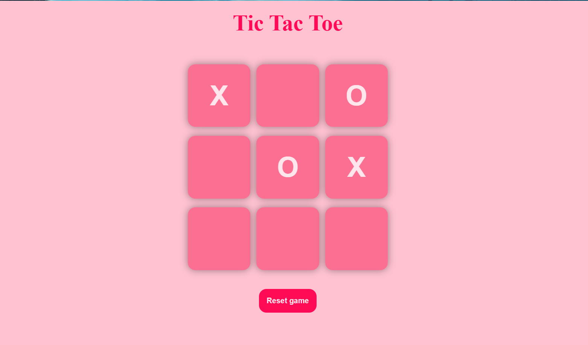
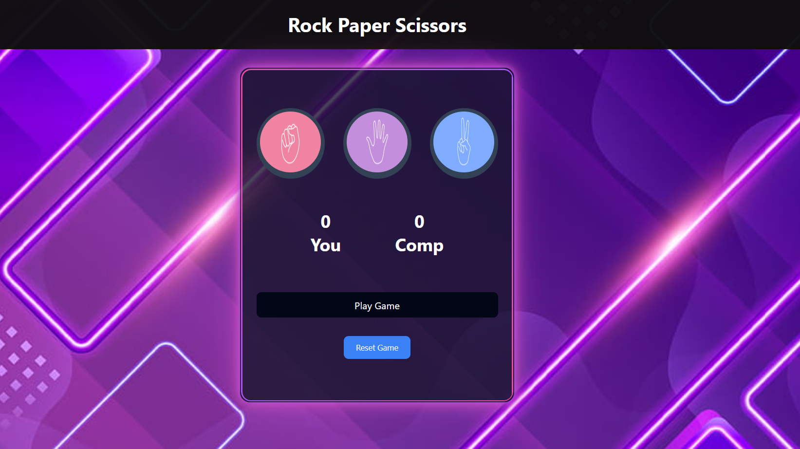

# JS-Practice-Projects

This repository contains my early-stage JavaScript projects, focusing on building logic and interactivity. These projects were created to solidify my understanding of core DOM manipulation, event handling, and game logic.

## 🎮 Projects

### 1. Tic Tac Toe
Focus: Game state management, conditional logic, and DOM manipulation.
  

   

### 2. Rock Paper Scissors
Focus: Random number generation, user input handling, and score tracking.
  

   

---

## 🛠 Technical Skills
*   **Core:** JavaScript (ES6+)
*   **Structure:** HTML5 & CSS3
*   **Concepts:** Event Listeners, Logic Flow, DOM Updates

